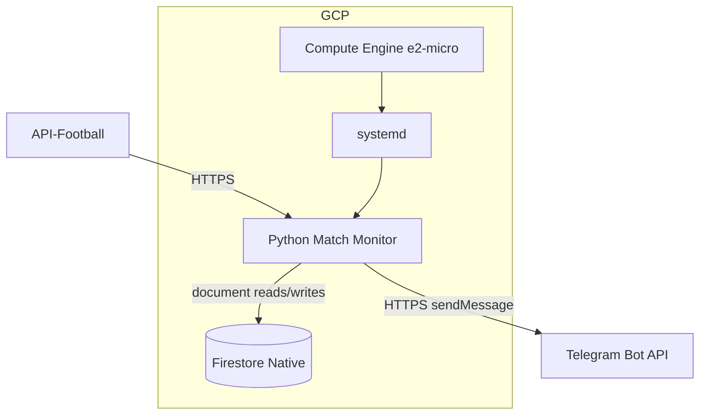
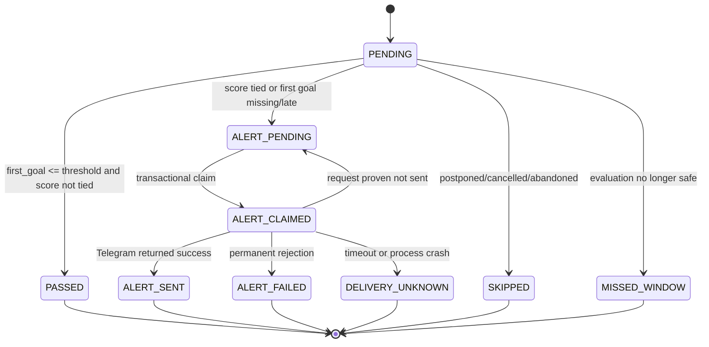
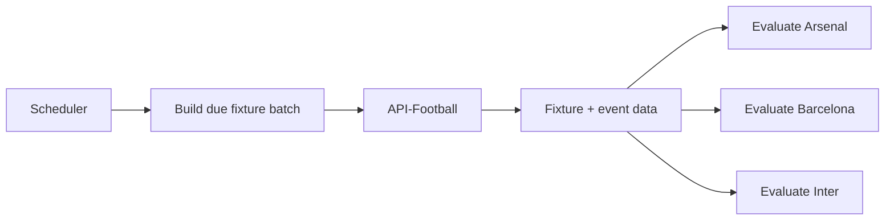
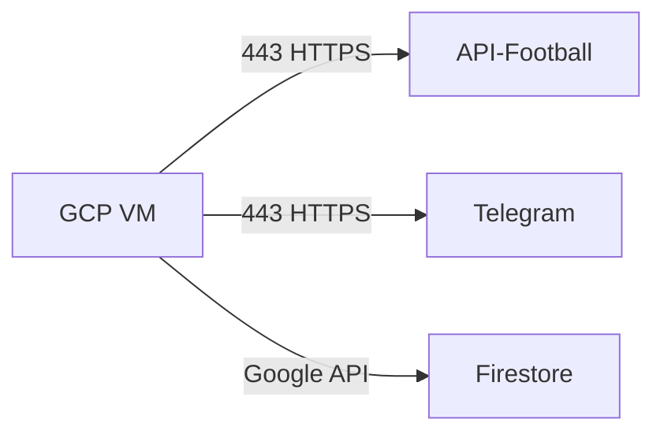

# Football First-Goal Monitoring Platform

---

## 1. Purpose

Build a continuously running service that monitors selected football teams matches and sends a Telegram alert when a team has **not scored its first goal before its configured statistical threshold or there is tie on this time**.


Example:

```text
Manchester City threshold = 31.97 minutes

Match starts
    ↓
31.97 minutes reached
    ↓
Is the score tied at 31.97'?
    ├── Yes → send a tie alert once
    └── No  → did Manchester City score before or at 31.97'?
                  ├── Yes → mark match as PASSED
                  └── No  → send a first-goal alert once
```

The service must:

- minimize football API usage;
- avoid duplicate alerts;
- survive process and VM restarts;
- handle delayed or cancelled fixtures;
- remain simple and inexpensive to operate.

---

## 2. Functional Requirements

The system shall:

1. Maintain a configurable list of monitored teams.
2. Maintain one first-goal threshold per team.
3. Monitor domestic league fixtures only.
4. Discover tracked fixtures automatically.
5. Wake only when a tracked fixture is close to its threshold.
6. Determine the team's actual first scored goal from match events.
7. Send a Telegram alert if:
   - the team's first goal is absent or occurs after the threshold; or
   - the reconstructed score at the threshold is tied.
8. Send at most one alert per team per fixture.
9. Persist state across restarts.
10. Handle postponed, cancelled, abandoned, delayed, and completed fixtures.
11. Keep football API usage low.
12. Produce useful operational logs.

---

## 4. Initial Team Pool


```
| Team                | League              | Threshold         |
| ------------------- | ------------------- | ----------------: |
| FC Porto            | Primeira Liga       |                24 |
| PSV                 | Eredivisie          |                26 |
| Inter Milan         | Serie A             |                29 |
| Benfica             | Primeira Liga       |                29 |
| Slavia Prague       | Czech First League  |                29 |
| Fenerbahce          | Süper Lig           |                29 |
| Real Betis          | La Liga             |                29 |
| AGF Aarhus          | Danish Superliga    |                30 |
| Manchester City     | Premier League      |                32 |
| Bayern Munich       | Bundesliga          |                33 |
| Real Madrid         | La Liga             |                33 |
| RB Leipzig          | Bundesliga          |                33 |
| SC Braga            | Primeira Liga       |                33 |
| Barcelona           | La Liga             |                34 |
| Dinamo Zagreb       | HNL                 |                34 |
| Manchester United   | Premier League      |                34 |
| Eintracht Frankfurt | Bundesliga          |                36 |
| Liverpool           | Premier League      |                36 |
| Arsenal             | Premier League      |                39 |
| PSG                 | Ligue 1             |                39 |
| Borussia Dortmund   | Bundesliga          |                40 |
| VfB Stuttgart       | Bundesliga          |                40 |
| Feyenoord           | Eredivisie          |                41 |
| West Ham            | Championship        |                42 |
| Sporting CP         | Primeira Liga       |                42 |
| Shakhtar Donetsk    | Ukrainian PL        |                44 |
| Sturm Graz          | Austrian Bundesliga |                53 |
| Galatasaray         | Süper Lig           |                29 |
```

Thresholds must be treated as configuration data, not application logic.

---

# 5. Proposed MVP Architecture



Recommended deployment:

```text
Google Cloud
├── Compute Engine e2-micro VM
│   ├── Debian Linux
│   ├── Python virtual environment
│   ├── systemd
│   └── monitor service
└── Firestore Native database
```

---

# 6. Component Responsibilities

## 6.1 Match Monitor

The Python daemon is responsible for:

```text
fixture discovery
threshold scheduling
live fixture polling
goal-event evaluation
state transitions
Telegram notification
retry handling
logging
```

It runs continuously under `systemd`.

---

## 6.2 API-Football

Used as the football-data provider.

Required fields:

```text
fixture ID
league ID
scheduled kickoff
actual kickoff
fixture status
home team ID
away team ID
score
goal events
event timestamps
```

Team IDs should be cached in Firestore after discovery.

---

## 6.3 Telegram Bot API

Used for outbound alerts.

Example:

```text
🚨 League name
Manchester City

Manchester City vs Fulham

Threshold: 31.97'
Current minute: 33'

Score: 0-0
```

Delivery method:

```text
POST /bot<TOKEN>/sendMessage
```

---

## 6.4 Firestore

Firestore Native provides durable, non-relational state independently of the
monitor VM.

Responsibilities:

```text
prevent duplicate alerts
cache team IDs
store tracked fixture state
survive process restart
survive VM reboot
survive VM replacement
```

Firestore is suitable because the system has:

```text
small documents
very low read and write volume
transactional document updates
no database server to operate
```

The VM service account receives only the Firestore data-access role required by
the monitor. The application uses Application Default Credentials; no database
credential is stored in `.env`.

---

# 7. Configuration Model

Recommended future file:

```text
config/teams.yaml
```

Example:

```yaml
teams:
  - key: man_city
    display_name: Manchester City
    threshold: 32
    enabled: true

  - key: barcelona
    display_name: Barcelona
    threshold: 34
    enabled: true
```


---

# 8. Firestore Document Model

## 8.1 Cached Team IDs

Collection and document ID:

```text
team_ids/{team_key}
```

Example document:

```json
{
  "api_team_id": 50,
  "api_name": "Manchester City",
  "updated_at": "server timestamp"
}
```

---

## 8.2 Match Watches

Collection and deterministic document ID:

```text
watches/{fixture_id}--{team_key}
```

Example document:

```json
{
  "fixture_id": 12345,
  "team_key": "man_city",
  "api_team_id": 50,
  "kickoff_at": "timestamp",
  "threshold": 32,
  "league_name": "Premier League",
  "home_team_id": 50,
  "away_team_id": 36,
  "home_name": "Manchester City",
  "away_name": "Fulham",
  "state": "PENDING",
  "first_goal_minute": null,
  "last_status": "NS",
  "delivery_attempt_id": null,
  "alerted_at": null,
  "created_at": "server timestamp",
  "updated_at": "server timestamp"
}
```

The deterministic document ID makes fixture discovery idempotent and supports
cases where both teams in the same fixture are monitored. The threshold is
snapshotted into the watch so a later configuration change does not alter an
already scheduled match.

---

# 9. Match State Machine



States:

| State | Meaning |
|---|---|
| `PENDING` | Still requires evaluation |
| `PASSED` | First goal occurred at/before threshold |
| `ALERT_PENDING` | Alert condition met and available to claim |
| `ALERT_CLAIMED` | A unique delivery attempt was claimed transactionally |
| `ALERT_SENT` | Telegram notification delivered |
| `ALERT_FAILED` | Telegram permanently rejected the delivery attempt |
| `DELIVERY_UNKNOWN` | Delivery may have succeeded; automatic retry is unsafe |
| `SKIPPED` | Fixture should not be evaluated |
| `MISSED_WINDOW` | Monitor was unavailable too long |

Terminal states should not be polled again. A stale `ALERT_CLAIMED` watch becomes
`DELIVERY_UNKNOWN`; it is not automatically retried.

---

# 10. Daily Fixture Discovery

Once per local calendar day:

```text
GET fixtures?date=YYYY-MM-DD
        ↓
match tracked team IDs
        ↓
upsert deterministic Firestore watch documents
```

This is cheaper than querying each team separately.

---

# 11. Threshold Scheduling

The daemon should not poll every tracked match for 90 minutes.

Instead:

```text
scheduled kickoff
+
threshold
-
precheck lead
```

Example:

```text
Kickoff:   20:00
Threshold: 32 minutes
Lead:      30 seconds

Initial wake:
20:31:30
```

The process remains mostly idle outside relevant threshold windows.

---

# 12. Live Polling Strategy

Recommended:

```text
daily discovery
      ↓
sleep
      ↓
threshold window approaches
      ↓
poll active tracked fixtures
      ↓
decision reached
      ↓
stop polling that team/fixture
```

Recommended interval:

```text
30 seconds
```

This is sufficient for a statistical alerting use case.

---

# 13. Batch Requests

When several matches overlap:

```text
Arsenal      fixture 1001
Barcelona    fixture 1002
Inter        fixture 1003
```

batch them:

```text
GET /fixtures?ids=1001-1002-1003
```

Then evaluate all teams locally.



This reduces request volume significantly.

---

# 14. Threshold Evaluation Logic

Do not evaluate only:

```python
team_score > 0
```

That would be incorrect.

Example:

```text
Threshold = 32'
First goal = 36'
Current minute = 40'
Current score = 1-0
```

The team has scored, but the condition still failed.

At the first reliable snapshot at or after the threshold, reconstruct the score
using goal events whose event time is at or before the threshold. Then apply:

```python
score_was_tied = home_goals_at_threshold == away_goals_at_threshold
late_or_missing_first_goal = first_goal_minute is None or first_goal_minute > threshold

should_alert = score_was_tied or late_or_missing_first_goal
```

If `should_alert` is false, transition the watch to `PASSED`. If it is true,
transition it to `ALERT_PENDING`. This logic handles `0-0`, score ties such as
`1-1`, and teams whose first goal occurred only after their threshold.

---

# 18. API Quota Strategy

Target pattern:

```text
~1 request/day
    fixture discovery

+

small number of requests
    only around threshold windows

+

batch requests
    for overlapping fixtures
```

Avoid:

```text
GET /fixtures?live=all
every 30 seconds
24/7
```

That approach wastes quota when no tracked teams are playing.

---

# 19. GCP Deployment

## Recommended MVP

```text
Compute Engine e2-micro
```

Suggested filesystem:

```text
/opt/football-goal-alert/
├── src/
├── config/
│   └── teams.yaml
├── .venv/
└── .env
```

Durable match state is held in Firestore, so the VM needs no separate data
disk. Application files on the boot disk are replaceable deployment artifacts.

---

# 20. systemd

Recommended service behavior:

```ini
Restart=always
RestartSec=15
```

This covers:

```text
Python crash
temporary provider outage
network failure
VM reboot
```

---

# 21. Networking

The application only requires outbound HTTPS.



No inbound application ports are required.

Therefore:

```text
port 80     not required
port 443    not required inbound
port 8080   not required
load balancer not required
```

---

# 22. Secrets

Required secrets:

```text
API_FOOTBALL_KEY
TELEGRAM_BOT_TOKEN
TELEGRAM_CHAT_ID
```

## MVP

Store in:

```text
.env
```

and protect with:

```bash
chmod 600 .env
```
---

# 23. Logging

Recommended fields:

```text
fixture_id
team_key
api_team_id
threshold
first_goal_minute
match_status
state
api_latency
remaining_quota
telegram_result
```

Example:

```text
INFO team=man_city fixture=12345 threshold=31.97 status=1H

INFO team=man_city fixture=12345 first_goal=18 state=PASSED
```

Alert case:

```text
WARN team=psv fixture=98765 first_goal=null threshold=25.61 state=ALERT_SENT
```

---

# 24. Error Handling

## API Failure

```text
API call fails
    ↓
log error
    ↓
backoff
    ↓
retry
```

One failed request must not terminate the daemon.

---

## Telegram Failure

Recommended behavior:

```text
condition detected
      ↓
state = ALERT_PENDING
      ↓
Firestore transaction claims a unique delivery_attempt_id
      ↓
state = ALERT_CLAIMED
      ↓
Telegram send attempted once
      ├── success                → ALERT_SENT
      ├── proven not transmitted → ALERT_PENDING
      ├── permanent rejection    → ALERT_FAILED
      └── timeout/crash/unknown  → DELIVERY_UNKNOWN
```

Telegram `sendMessage` does not provide an idempotency key. Retrying after an
ambiguous timeout or process crash can therefore create a duplicate. The MVP
prioritizes the requirement of at most one automated alert: ambiguous outcomes
are surfaced for operator review rather than retried automatically. If delivery
reliability is later prioritized over strict deduplication, `DELIVERY_UNKNOWN`
can be retried with the explicit acceptance that a rare duplicate is possible.

---

## Process or VM Restart

```text
restart
   ↓
systemd launches process
   ↓
active Firestore watches loaded
   ↓
terminal fixtures ignored
   ↓
pending fixtures resume
```

---

# 25. Duplicate Prevention

The combination of a deterministic watch document ID:

```text
watches/{fixture_id}--{team_key}
```

and a Firestore transaction that changes:

```text
ALERT_PENDING → ALERT_CLAIMED
```

ensures only one monitor worker can claim an automated delivery attempt for a
team and fixture. A claim records a unique `delivery_attempt_id` before any
Telegram request is made.

This must remain true across:

```text
polling cycles
exceptions
process restarts
VM reboots
```

---

# 26. Observability

For MVP:

```bash
systemctl status football-goal-alert

journalctl \
  -u football-goal-alert \
  -f
```

Recommended future metrics:

```text
fixtures_discovered_total
fixtures_monitored_total
alerts_sent_total
api_requests_total
api_errors_total
telegram_errors_total
last_successful_discovery_timestamp
last_successful_api_call_timestamp
```

Later export to Google Cloud Monitoring.

---

# 27. Alert Format

Recommended message:

```text
🚨 FIRST-GOAL ALERT 
League: Premier League

Team: Manchester City
Match: Manchester City vs Fulham

Threshold: 32'
Current score: 0-0
Match minute: 33'
```

Tie case:

```text
🚨 TIE ALERT

League: Premier League

Team: Manchester City
Match: Manchester City vs Fulham

Threshold: 32'
Current score: 1-1
Match minute: 33'

The first goal was scored and there is a tie.
```

---

# 28. Repository Structure

Recommended structure:

```text
football-goal-alert/
│
├── src/
│   ├── monitor.py
│   ├── api_football.py
│   ├── telegram.py
│   ├── store.py
│   ├── evaluator.py
│   └── config.py
│
├── config/
│   └── teams.yaml
│
├── deploy/
│   └── football-goal-alert.service
│
├── infra/
│   ├── config.tm.hcl
│   ├── common.tm.hcl
│   └── services/
│       ├── project-services/
│       │   └── stack.tm.hcl
│       ├── networking/
│       │   └── stack.tm.hcl
│       ├── iam/
│       │   └── stack.tm.hcl
│       ├── firestore/
│       │   └── stack.tm.hcl
│       └── compute-engine/
│           ├── stack.tm.hcl
│           └── templates/
│
├── requirements.txt
├── README.md
├── terramate.tm.hcl
└── .gitignore
```

Each service folder owns its Terraform resources and state. `project-services`
enables the APIs, then `networking`, `iam`, and `firestore` can be applied.
`compute-engine` reads their outputs and runs last. Terramate records this order
in the individual `stack.tm.hcl` files.

---

# 34. Architecture Decision

## Selected

```text
Compute Engine e2-micro
+
Python daemon
+
systemd
+
Firestore Native
+
API-Football
+
Telegram Bot API
```
